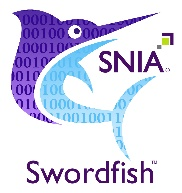
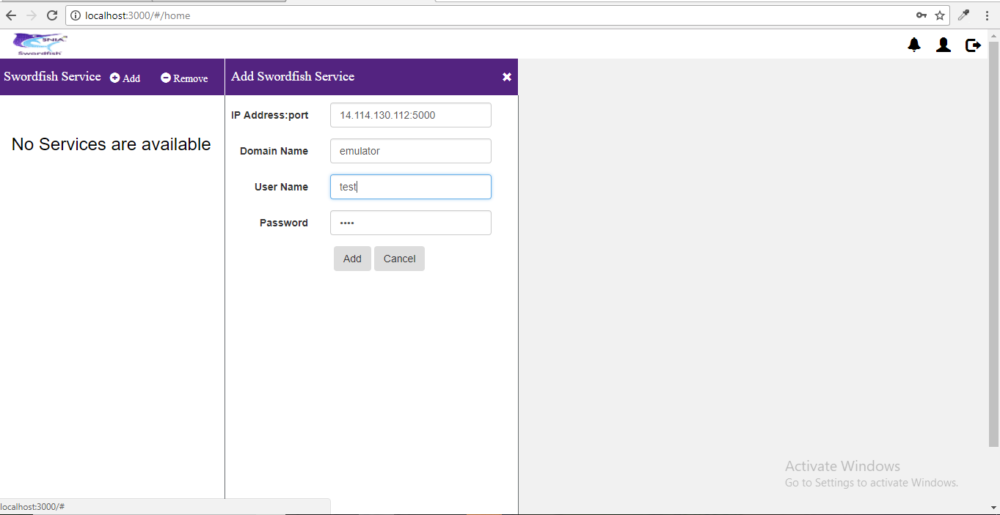
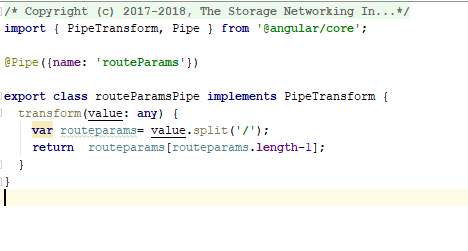

SNIA SwordfishTM Basic Web Client Developer Guide
=================================================

The purpose of this Developer Guide is to illustrate how developers can deploy
the Basic Web Client to connect to one or more Swordfish services including the
Swordfish API Emulator, and present in a web UI frame the entire Redfish and
Swordfish hierarchy. The Swordfish Basic Web Client provides basic capabilities
for managing multiple services simultaneously, modifying configurable properties
and adding or removing elements from the service through the web UI.
Installation and user guides are also available.

### Contents
- [Disclaimer](#disclaimer)
- [Introduction](#introduction)
- [Technology](#technology)
  * [CORS (Cross-Origin Resource Sharing)](#cors\-cross-origin-resource-sharing)
  * [URI Request and Response Model](#uri-request-and-response-model)
  * [Node.js](#nodejs)
  * [Express](#express)
  * [Angular-cli](#angular-cli)
- [Overview of Redfish and Swordfish Usage](#overview-of-redfish-and-swordfish-usage)
- [Redfish and Swordfish Usage Using Web Client](#redfish-and-swordfish-usage-using-web-client)
- [Project Structure of Swordfish Basic Web Client](#project-structure-of-swordfish-basic-web-client)
- [Data Flow](#data-flow)
- [Components Used for Swordfish Basic Web Client](#components-used-for-swordfish-basic-web-client)

Disclaimer
==========

The information contained in this publication is subject to change without
notice. The SNIA makes no warranty of any kind with regard to this
specification, including, but not limited to, the implied warranties of
merchantability and fitness for a particular purpose. The SNIA shall not be
liable for errors contained herein or for incidental or consequential damages in
connection with the furnishing, performance, or use.

Suggestions for revisions should be directed to http://www.snia.org/feedback/.

Copyright © 2016-2019 Storage Networking Industry Association.

[Top](#section)

Introduction
============

**SNIA Swordfish™ Specification**

The SNIA Swordfish™ specification helps to provide a unified approach for the
management of storage and servers in hyperscale and cloud infrastructure
environments, making it easier for IT administrators to integrate scalable
solutions into their data centers. SNIA Swordfish is an extension of the DMTF
Redfish specification, so the same easy-to-use RESTful interface is used, along
with JavaScript Object Notation (JSON) and Open Data Protocol (OData), to
seamlessly manage storage equipment and storage services in addition to servers.

SNIA Swordfish is designed to integrate with the technologies used in cloud data
center environments and can be used to accomplish a broad range of storage
management tasks from the simple to the advanced.

SNIA Swordfish has been designed around management use cases that focus on what
IT administrators need to do with storage equipment and storage services in a
data center. As a result, the API provides functionality that simplifies the way
storage can be allocated, monitored, and managed.

**SNIA Swordfish Basic Web Client**

The Swordfish Basic Web Client can connect to one or more Swordfish services
(including the Swordfish API Emulator), and present in a web UI frame the entire
Redfish and Swordfish hierarchy.

The Swordfish Basic Web Client can connect to one or more Swordfish (or Redfish)
services (including emulators), and present in a web UI frame the entire system
hierarchy. The basic web client also provides basic capabilities to modify
configurable Properties (as specified in the schema), as well as providing a
basic interface to add or remove elements from the service through a Web UI.

[Top](#section)

Technology 
===========

The Swordfish Basic Web Client provides basic capabilities for managing multiple
services simultaneously, modifying configurable Properties and adding or
removing elements from the service through the web UI. The Swordfish Basic Web
Client gives a clear demonstration of collections and its sub collections data.
The detailed view of a real time system’s data is organized in a hierarchical
manner showing the kind of relation (members, links, properties, etc.) between
them using a fan out user interface design approach.

CORS (Cross-Origin Resource Sharing)
----------------------------------------

-   Cross-origin resource sharing (CORS) is a mechanism that allows restricted
    resources (e.g. fonts) on a web page to be requested from another domain,
    outside the domain from which the first resource was served.

-   A web page may freely embed cross-origin images, stylesheets, scripts,
    frames, and videos.

-   Certain "cross-domain" requests, notably Ajax requests, are forbidden by
    default by the same-origin security policy.

-   For Ajax and HTTP request methods that can modify data (usually HTTP methods
    other than GET, or for POST usage with certain MIME types), the
    specification mandates that browsers "preflight" the request, soliciting
    supported methods from the server with an HTTP OPTIONS request method, and
    then, upon "approval" from the server, sending the actual request with the
    actual HTTP request method.

-   Servers can also notify clients whether "credentials" (including Cookies and
    HTTP Authentication data) should be sent with requests.

[Top](#section)

URI Request and Response Model
------------------------------

-   The Web Request and Web Response classes contain methods and properties that
    apply generically across the different supported protocols and enable
    applications to download and upload data given a specific URI and to specify
    authentication details, proxy information, and content details such as the
    type and size of the content.

-   An asynchronous pattern is also provided for any operation that could be
    blocking on network activity.

-   In angular, Request instances are typically created by higher-level classes,
    like Http and Jsonp, but it may occasionally be useful to explicitly create
    Request instance.

    **Ex**: this.http.request(new Request ({
    method: RequestMethod.Get, // could be POST,PUT,DELETE
    url: URL, // Endpoint to communicate to server
    body:{} // optional
    }));

-   **Response Model:** Though this object isn't usually instantiated by
    end-users, it is the primary object interacted with when data is added to a view.

[Top](#section)

Node.js
-------

-   Node (or more formally Node.js) is an open-source, cross-platform, runtime
    environment that allows developers to create server-side tools and applications in JavaScript.

-   The runtime is intended for use outside of a browser context (i.e. running
    directly on a computer or server OS).

-   As such, the environment omits browser-specific JavaScript APIs and adds
    support for more traditional OS APIs including HTTP and file system
    libraries.

-   The node package manager (NPM) provides access to hundreds of thousands of
    reusable packages.

[Top](#section)

Express 
--------

-   Express.js, a Sinatra-inspired web development framework for Node.js, and
    the de-facto standard for the majority of Node.js applications currently in use.

-   Express is the most popular Node web framework, and is the underlying
    library for a number of other popular Node web frameworks. It provides
    mechanisms to:

1.  Write handlers for requests with different HTTP verbs at different URL paths
    (routes).

2.  Integrate with "view" rendering engines in order to generate responses by
    inserting data into templates.

3.  Set common web application settings like the port to use for connecting, and
    the location of templates that are used for rendering the response.

4.  Add additional request processing "middleware" at any point within the
    request handling pipeline.

[Top](#section)

Angular-cli
-----------

There are two main ways to compile and serve an Angular 2 applications, via web
pack or **systemjs**. For this example, Swordfish Basic Web Client web pack is
used.

-   Any dependency added in the **package.json** needs to be installed.

-   Run **npm** install to install the package dependencies.

1.  The **tsconfig.json** file tells compiler how we want to compile
    **TypeScript** files.

2.  The two most important properties are:
    {
    “target”: “ES5” ,
    “module”: “commonjs”
    }

    -   ECMAScript version  is set to ES5, and desired modules to generate should be in the commonjs format.

3.  The **package.json** file tells how to start the applications.

4.  **Bootstrap** tells the compiler which module and component must be run
    first, we need to specify the bootstrap component.

5.  To **Bootstrap** the module, include it in main.ts file.

6.  To **Bootstrap** the application, include the necessary resources into the
    index.html file.

    Ex: \<body\>
    \<app-home\>loading….\</app-home\>
    \</body\>

    -   Here, Angular has instantiated AppHome Component and loaded its template
        into the app-home element.

7.  Inside **app.module.ts**, inject the AppHome Component into the ‘bootstrap’
    section.

[Top](#section)

Overview of Redfish and Swordfish Usage
===================================

-   The Swordfish basic web client is compatible with all current versions of
    Redfish/Swordfish services. It parses the json output into various display
    section depending on the property type.

-   Via the Swordfish basic web client, based on the navigation property from
    XML Schema. definitions, links are enabled to click and follow.

-   The response model is segregated into 4 entities, including:

1. Object-Object Entity

2. Object-Array

3. Array-Object

4. Array-Array

-   The resultant data after segregation is shown under properties, in the OData
    and links sections.

-   Properties can be editable if the read-only property is set to false in the
    schema definitions.

-   User can extend the collection in the service by adding a new collection to
    the existing one using add collection functionality.

[Top](#section)

Redfish and Swordfish Usage Using Web Client
========================================

1.  **Support to new property**: The newly added property is appended as a part
    of request body to the service that talks with the service. The following
    code block is implemented in such a way that it appends the new property to
    the existing collection of properties.

    

2.  Basic web client is designed and implemented in such a way that it supports
    both static and dynamic objects.

3.  A complete IP Address is fetched and framed to make a service call to a
    service to retrieve the information.

    Note: The image below allows the user to provide mandatory fields data that
    are used to talk with the service.

1.  Programmatical code: add-emulator.component.html:

    

2.  Web client has the capability to add multiple services in a single session.

    

    Following methods in [home.service.ts](http://home.service.ts) service
    allows user to add multiple services by storing the IP address of respective
    service in local storage.

    When a web client tries to talk to any schema it will respond with a HTTP status code in one of two
    ways:

    1. **Success:** Schema replies with a 200-status code along with the schema
    body as apart of response to the web client.

    2. **Error:** Schema replies with a status code of 500 if the request made
    by the web client is inappropriate.

    Error responses may vary from version to version. Some may indicate the code
    as part of status code or append as part of the body of the response. If the
    web client encountered any issue while talking to a service implemented with
    a newer version of a redfish or swordfish schema, check the error response
    and add the status code in the below lines of app.js file.

    

    A JSON is built for the collections based on their respective schema
    definitions.

    Web client talks with the JSON structure using HTTP methods (GET, POST, PUT
    and DELETE).

    

    File: [home.service.ts](http://home.service.ts)

3.  **Note: create ()** method in [home.component.ts](http://home.component.ts)
    file iterates through all the links and properties of the collection. So,
    even any changes made/added to the collection, modifications in the schema
    definitions in future does not require any changes to the UI code.

    

    **getSysOverview** () method in the **list.menu.ts** file checks for the
    links present in the collection and further calls the create () method to
    create a dynamic blade in the UI.

    

    Please refer to Swordfish Basic Web Client User Guide on how to add/remove
    collections/properties.

[Top](#section)

Project Structure of Swordfish Basic Web Client
===============================================

1.  The Application is built using node, express and angular-cli.

2.  **Package.json:** this file contains list of all the dependencies that are
    required to run an angular-cli.

3.  Run ‘**npm install**’ to install all the specified dependencies into local
    project.

4.  **node_modules** will be created which contains the copy of the
    libraries/dependencies.

Project Architecture of Swordfish Basic Web Client
===============================================

1.  **views** folder contains the modules and components that are used to build
    the basic web client.

2.  **views/src** – This folder contains all the modules and components that aer
    used to build basic web client.

3.  **views/src/app –** This folder contains all the building blocks of basic
    web client application.

4.  **views/src/assets** – This folder contains all the static files,json and
    images that are used across the application.

5.  **angular-cli.json** - Contains the configurations that are required to load
    the angular-cli.

6.  **views/src/environments -** Allows the developer to specify settings to customize application behavior.

User defined environments can be created in the .angular-cli.json file. The default environments are:

1.  **source**: use settings defined in environments/environment.ts.

2.  **dev**: use settings defined in environments/environment.ts.

3.  **prod**: use settings define in environments/environment.prod.ts.

[Top](#section)

 Data Flow
==========

The below diagram illustrates the data flow between components.

#### Views Folder

1.  Any Modifications/addition of new files that relates to functional change or
    enhancement of the basic web client are to be done to files in this folder.

2.  **Middleware(app.js):** This file is used as middleware between basic web
    client and the backend server.

3.  **Views/src/app/home**: This folder contains the logic that is used to
    consume the input and produce the output.

[Top](#section)

Components Used for Swordfish Basic Web Client
==============================================

-   **App.js** 

-   App.js acts as a middleware between angular components (basic web client) and
    server (backend).

-   All the required libraries are injected in to the app.js file using
    **require** method.

-   Example:

    **var** *cors* = require(**'cors'**);  
    **var** http = require(**'http'**);  
    **var** path = require(**'path'**);  
    **var** *request* = require(**'request'**);

-   To handle CORS issue, added required headers using app.use().

   app.use(**function**(req, res, next) {  
   res.header(**'Access-Control-Allow-Origin'**, **'\*'**);  
   res.header(**'Access-Control-Allow-Headers'**, **'Origin, X-Requested-With,
   Content-Type, Accept,X-Auth-Token,Cookie-Headers'**);  
   res.header(**'Access-Control-Allow-Methods'**,
   **'POST,GET,OPTIONS,PUT,DELETE'**);  
   res.header(**'Allow'**,**'HEAD, GET, PATCH, POST, OPTIONS, DELETE'**);  
   next();  
   });

-   All methods that are used to communicate the view (basic web client) and
    backend (server) resides in this file.

-   CORS dependency is used to handle all the domain related issues and to
    transfer data from one domain to another.

-   **app.get ():** This method is used to fetch data from the endpoint.

-   **app.post ():** This method is used to add data to the endpoint.

-   headers can be added and body is sent along with request.

-   **app.delete()** This method is used to perform any delete operations.

-   **app.module.ts**: This file organizes and separates the code.

-   **imports:** You can import any other modules into the imports section.

-   **declarations:** You declare any components in your declarations. Any
    components used in the routing of that module, must be declared in that
    module. If components are used in another module, then you only list them in
    that other module. Pipes created in the application need to declare in the
    declarations section.

-   **Providers:** you can inject all the services into providers section.

-   **Bootstrap:** you can specify which component should bootstrap/load first into
    the browser in the bootstrap section.

    

-   **home.component.ts**:

    The Component holds the configuration properties of the component like
    selector, names of properties, names of events and a list of the injectables
    into the component. The value of the selector can be the same as the string
    to be used on HTML Markup, it doesn’t need to be camel-cased.

    

-   To create a component (collection blade) dynamically ,a reference to the
    parent div is created with the help of \@ViewChild interface.

-   To handle sessions and to maintain track of cookie id received while adding
    a service \@HostListener and window events are used.

    

-   A **constructor()** is used to load data for html pages when component is
    instantiated and to inject dependencies of services.

    

-   The logic that identify the links present, properties that exist for a
    collection is implemented in the **create()** method.

-   **componentFactoryResolver.resolveComponentFactory()** is used to create a
    new blade(collection blade) if the links do exist for that collection.

-   **list.component.ts :** The segregation of collection information runs in
    this component.

-   Whenever a new service is added to the collection the response from the
    observable is fetched using subscribe and displays in view.

-   The navigable properties of collections are extracted from the \@Odata
    string using the below method.

    

-   All the properties of the collection is fetched and read entity either
    object/Array using **getSysOverview()**.

    

-   **home.service.ts:** The service layer from the client side is implemented
    in **home.service.ts** file.

-   An instance of http is created to make http calls across the browser.

    

[Top](#section)

-   **http.get** is used to make a request to fetch data from the server.

-   mock API’s are built using express to avoid CORS. So, any request made from
    the [home.service.ts](http://home.service.ts) file will first hit the app.js
    file.

-   from app.js file the request are forwarded to the server.

-   **pipes/key-value.ts**: This file is used to process and format the desired
    data.

-  The object/array entities are divided into key-value pairs where the property is
stored into key and the value of the property is stored into value.

[Top](#section)

**pipes/routeParams.ts**: Is used to get the name of the current active
collection from the link this pipe is used.

**dist folder:** This folder contains the compiled code of the angular
application.

[Top](#section)

Additional information on the SNIA Swordfish specification and use is available
at https://www.snia.org/swordfish and <https://github.com/SNIA>.
