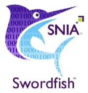

SNIA SwordfishTM Basic Web Client Installation Guide
====================================================

The purpose of this Installation Guide is to illustrate the Swordfish Basic Web
Client installation steps needed to enable the client to connect to one or more
Swordfish services and present in a web UI frame the entire Redfish and
Swordfish hierarchy. Developer and user guides are also available.

Contents
- [Disclaimer](#disclaimer)
- [Introduction](#introduction)
- [Prerequisites](#prerequisites)
- [Environment Set Up for Windows or Linux](#environment-set-up-for-windows-or-linux)
  * [Windows Set Up Steps](#windows-set-up-steps)
  * [Linux Set Up Steps](#linux-set-up-steps)
- [Node and npm Installation](#node-and-npm-installation)
- [Web Client Installation](#web-client-installation)
- [Directly Running the Application](#directly-running-the-application)
- [Port and Firewall Configuration](#port-and-firewall-configuration)

The purpose of this Installation Guide is to illustrate the Swordfish Basic Web
Client installation steps needed to enable the client to connect to one or more
Swordfish services and present in a web UI frame the entire Redfish and
Swordfish hierarchy. Developer and user guides are also available.

Disclaimer
==========

The information contained in this publication is subject to change without
notice. The SNIA makes no warranty of any kind with regard to this
specification, including, but not limited to, the implied warranties of
merchantability and fitness for a particular purpose. The SNIA shall not be
liable for errors contained herein or for incidental or consequential damages in
connection with the furnishing, performance, or use.

Suggestions for revisions should be directed to http://www.snia.org/feedback/.

Copyright © 2016-2019 Storage Networking Industry Association.

[Top](#section)

Introduction
============

SNIA Swordfish™ Specification

The SNIA Swordfish™ specification helps to provide a unified approach for the
management of storage and servers in hyperscale and cloud infrastructure
environments, making it easier for IT administrators to integrate scalable
solutions into their data centers. SNIA Swordfish is an extension of the DMTF
Redfish specification, so the same easy-to-use RESTful interface is used, along
with JavaScript Object Notation (JSON) and Open Data Protocol (OData), to
seamlessly manage storage equipment and storage services in addition to servers.

SNIA Swordfish is designed to integrate with the technologies used in cloud data
center environments and can be used to accomplish a broad range of storage
management tasks from the simple to the advanced.

SNIA Swordfish has been designed around management use cases that focus on what
IT administrators need to do with storage equipment and storage services in a
data center. As a result, the API provides functionality that simplifies the way
storage can be allocated, monitored, and managed.

SNIA Swordfish Basic Web Client

The Swordfish Basic Web Client can connect to one or more Swordfish or Redfish
services (including the Swordfish API Emulator), and present in a web UI frame
the entire Redfish and Swordfish hierarchy.

The Swordfish Basic Web Client provides basic capabilities for managing multiple
services simultaneously, modifying configurable Properties and adding or
removing elements from the service through the web UI. The Swordfish Basic Web
Client gives a clear demonstration of collections and its sub collections data.
The detailed view of a real time system’s data is organized in a hierarchical
manner showing the kind of relation (members, links, properties, etc.) between
them using a fan out user interface design approach.

The Swordfish Basic Web Client can connect to one or more Swordfish (or Redfish)
services (including emulators), and present in a web UI frame the entire system
hierarchy. The basic web client also provides basic capabilities to modify
configurable Properties (as specified in the schema), as well as providing a
basic interface to add or remove elements from the service through a Web UI.

[Top](#section)

Prerequisites
=============

Node.js and npm are essential components necessary to run the SNIATM Swordfish
Basic Web Client. Node.js powers client development and build tools. The npm
package manager, itself a node application, installs JavaScript libraries.

The node.js environment installs and runs a web server on the system. To run the
client, you will first need to launch the web server, then point a web browser
at the web server to run the Swordfish Basic Web Client interface.

Note: You may also need to open up appropriate ports on your system’s firewall
to enable appropriate operation of the Swordfish Basic Web Client.

| **Operating System** | Windows/Linux       |
|----------------------|---------------------|
| **Node.js**          | v.8.1.1             |
| **Npm**              | v5.0.3              |
| **Angular/cli**      | 1.4.5               |
| **Express**          | 4.15.5              |
| **IDE**              | WebStorm (optional) |

[Top](#section)

Environment Set Up for Windows or Linux
=======================================

Windows Set Up Steps
--------------------

1.  Download the node.js from <https://nodejs.org/en/download/>

2.  Install node.exe file.

>   note: **npm** will be installed along with node.

1.  Run the batch file for successful installation of Express and angular/cli

    [Image: commands.bat](#port-and-firewall-configuration)

    Express and angular/cli installation commands are provided in a batch
    (commands.bat) file.

[Top](#section)

Linux Set Up Steps
------------------

1.  Install **Ruby** and **GCC**. Versions (Ruby 1.8.6 or newer and GCC 4.2 or
    newer.)

2.  For **Ubuntu** or **Debian**-based Linux distributions, run the following
    command in your terminal:

>   **sudo apt-get install build-essential curl git m4 ruby texinfo libbz2-dev
>   libcurl4-openssl-dev libexpat-dev libncurses-dev zlib1g-dev**

1.  Then select **Y** to continue and wait for the packages to be installed.

2.  For **Fedora** based Linux distributions run the following command in your
    terminal application:

>   **sudo yum groupinstall 'Development Tools' && sudo yum install curl git m4
>   ruby texinfo bzip2-devel curl-devel expat-devel ncurses-devel zlib-devel**

1.  Then select Y to continue and wait for the packages to be installed.

2.  **Homebrew**. Homebrew is a package manager originally for the Mac, but it’s
    been ported to Linux as Linux brew, making installing most open-source
    software (like Node) as simple as writing: brew install node.

3.  To install Homebrew for Linux, open your terminal application and paste in
    the command:

>   **ruby -e "\$(curl -fsSL
>   https://raw.githubusercontent.com/Homebrew/linuxbrew/go/install)"**

1.  Follow the instructions in the terminal to complete the installation
    process.

2.  Once Linux brew is installed, you’ll need add the following 3 lines to your
    .bashrcor .zshrc file:

>   **export PATH="\$HOME/.linuxbrew/bin:\$PATH"**

>   **export MANPATH="\$HOME/.linuxbrew/share/man:\$MANPATH"**

>   **export INFOPATH="\$HOME/.linuxbrew/share/info:\$INFOPATH"**

[Top](#section)

Node and npm Installation
=========================

1.  Open the terminal and run the following command:

**brew install node**

1.  To Test for successful installation of node and npm go to terminal and type:

>   **node -v**

>   **npm -v**

1.  This should print the version numbers of node and npm.

2.  For installation of angular-cli and express, go to terminal and run the
    following commands:

>   **brew install angular-cli** or **npm install -g \@angular/cli\@latest**

>   **brew install angular-cli** or **npm install -g express**

[Top](#section)

Web Client Installation
=======================

>   Run the below commands in terminal/console window, if you are running the
>   application for the first time.

1.  **cd views && npm install **

-   cd views change the current working directory(project) path to views folder
    where angular application resides.

-    npm install will install all modules listed as dependencies in package.
    Json in to the local node modules folder, which are required to run the
    angular application.

1.  **ng build **

    -   The ng build command is intended for building the app and deploying the
        build artifacts.

    -   The build artifacts will be stored in the dist directory.

2.  **cd.. && npm install** 

-   **cd..** reverts the path from views folder to project folder.

-   **npm** install installs all modules listed as dependencies in project's
    package.json into the local node modules folder required to run the node
    application. (package.json is a filename containing the included dependency
    packages).

1.  **npm start** 

-   This runs a command specified in the package. json’s "start" property of its
    "scripts" object.

-   npm scripts let you group together and run logically related commands and
    establishes a development server to execute the code, launches the
    application on browser.

1.  Open **http://localhost:3000/** in your browser to access the Web Client. 

>   **npm start** will launch the application on browser's http protocol and
>   localhost as IPaddress on port 3000.

>   \*\* Note: Build to angular application is required upon any new pull
>   request or if any changes are detected.

>   Follow the below steps to build and run the application.

1.  **cd views** && **ng build** 

2.  **cd..** && **npm start** 

>   Or 

>   Directly run the application using **npm start.**

[Top](#section)

Directly Running the Application
================================

If the application is already built and requires no changes, run **npm start**
from the command prompt where your application resides.

[Top](#section)

Port and Firewall Configuration
===============================

-   Allow access for firewall while installing NodeJS.

-   The application default port is **3000**. If this port is already in use:
    change the port number to user defined one.

-   Refer to the Swordfish Basic Web Client Developer guide on how to change the
    port number.

[Top](#section)

Additional information on the SNIA Swordfish specification and use is available
at <https://www.snia.org/swordfish> and <https://github.com/SNIA>.
