

#  SNIA SwordfishTM Basic Web Client User Guide

The purpose of this User Guide is to illustrate how the Basic Web Client can connect to one or more Swordfish services including the Swordfish API Emulator, and present in a web UI frame the entire Redfish and Swordfish hierarchy. Developer and installation guides are also available.

### Contents
- [Introduction](#introduction)
- [Run-time Environment](#run-time-environment)
    + [Default Port](#default-port)
    + [Default Web server](#default-web-server)
- [Swordfish Basic Web Client Functional Areas](#swordfish-basic-web-client-functional-areas)
  * [Basic Web Client Application Login](#basic-web-client-application-login)
  * [Add Swordfish Services](#add-swordfish-services)
  * [Delete Swordfish Service](#delete-swordfish-service)
  * [Add Collection](#add-collection)
  * [Delete Collection](#delete-collection)
  * [Edit Properties](#edit-properties)
  * [Logout](#logout)

**Disclaimer**

The information contained in this publication is subject to change without
notice. The SNIA makes no warranty of any kind with regard to this
specification, including, but not limited to, the implied warranties of
merchantability and fitness for a particular purpose. The SNIA shall not be
liable for errors contained herein or for incidental or consequential damages in
connection with the furnishing, performance, or use.

Suggestions for revisions should be directed to http://www.snia.org/feedback/.

Copyright © 2016-2019 Storage Networking Industry Association.

[Top](#section)

## Introduction 

**SNIA Swordfish™ Specification**

The SNIA Swordfish™ specification helps to provide a unified approach for the
management of storage and servers in hyperscale and cloud infrastructure
environments, making it easier for IT administrators to integrate scalable
solutions into their data centers. SNIA Swordfish is an extension of the DMTF
Redfish specification, so the same easy-to-use RESTful interface is used, along
with JavaScript Object Notation (JSON) and Open Data Protocol (OData), to
seamlessly manage storage equipment and storage services in addition to servers.

SNIA Swordfish is designed to integrate with the technologies used in cloud data
center environments and can be used to accomplish a broad range of storage
management tasks from the simple to the advanced.

SNIA Swordfish has been designed around management use cases that focus on what
IT administrators need to do with storage equipment and storage services in a
data center. As a result, the API provides functionality that simplifies the way
storage can be allocated, monitored, and managed.

[Top](#section)

**SNIA Swordfish Basic Web Client**

The Swordfish Basic Web Client can connect to one or more Swordfish services
(including the Swordfish API Emulator), and present in a web UI frame the entire
Redfish and Swordfish hierarchy.

The Swordfish Basic Web Client provides basic capabilities for managing multiple
services simultaneously, modifying configurable Properties and adding or
removing elements from the service through the web UI. The Swordfish Basic Web
Client gives a clear demonstration of collections and its sub collections data.
The detailed view of a real time system’s data is organized in a hierarchical
manner showing the kind of relation (members, links, properties, etc.) between
them using a fan out user interface design approach.

The Swordfish Basic Web Client can connect to one or more Swordfish (or Redfish)
services (including emulators), and present in a web UI frame the entire system
hierarchy. The basic web client also provides basic capabilities to modify
configurable Properties (as specified in the schema), as well as providing a
basic interface to add or remove elements from the service through a Web UI.

[Top](#section)

### Run-time Environment

Node.js and npm are essential to run the Swordfish Basic Web Client. Node powers
client development and build tools. The npm package manager, itself a node
application, installs JavaScript libraries. The node.js and npm environments can
be downloaded and installed on either Windows or Linux development systems. If
you are not already familiar with these tools, look online for additional
information to install and configure.

The node.js environment installs and runs a web server on the system. To run the
client, you will first need to launch the web server, then point a web browser
at the web server to run the Swordfish Basic Web Client interface.

Note: you may also need to open appropriate ports on your system’s firewall to
enable appropriate operation of the Swordfish Basic Web Client.

| **Operating System** | Windows/Linux       |
|----------------------|---------------------|
| **Node.js**          | v.8.1.1             |
| **Npm**              | v5.0.3              |
| **Angular/cli**      | 1.4.5               |
| **Express**          | 4.15.5              |
| **IDE**              | WebStorm (optional) |

##### Default Port

Node.js runs on 3000 port by default. For configuring port options, please refer to the SNIA Developer guide.

##### Default Web server

As part of the node.js system, a local web server is created which runs the
application locally. There are no additional steps required to install a
separate http-server, as the configuration information is specified in the
package.json files. For general installation instructions please refer to the
README.md file on the SNIA Swordfish Basic Web Client Github site:
<https://github.com/SNIA/Swordfish-basic-web-client>

[Top](#section)

## Swordfish Basic Web Client Functional Areas 

The Swordfish Basic Web Client is composed of the following functional areas to
access the data from Swordfish systems.

[Top](#section)

### Basic Web Client Application Login

Allows the User to utilize the features of Swordfish Basic Web Client by
authenticating.

For initial login, the user needs to provide the default Username and Password.

    Email: swordfish@snia.org

    Password: snia@123

These credentials can be changed once the default values are used.

Please refer to the Swordfish Basic Web Client Developer guide for instructions
on how to change the default Email and password

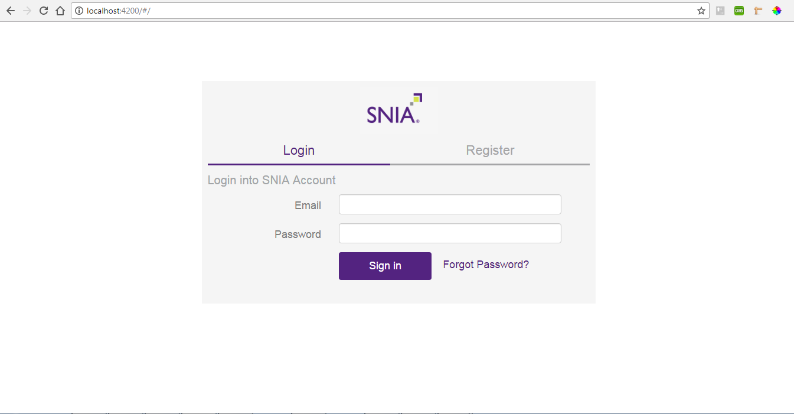

Enter Email and password in the input fields and click on Sign In button

[Top](#section)

### Add Swordfish Services

-   A list of Services is shown in the tab under Swordfish Services if they were
    added already.

-   A message showing “**No Services are available**” is shown if there are no
    Services added.

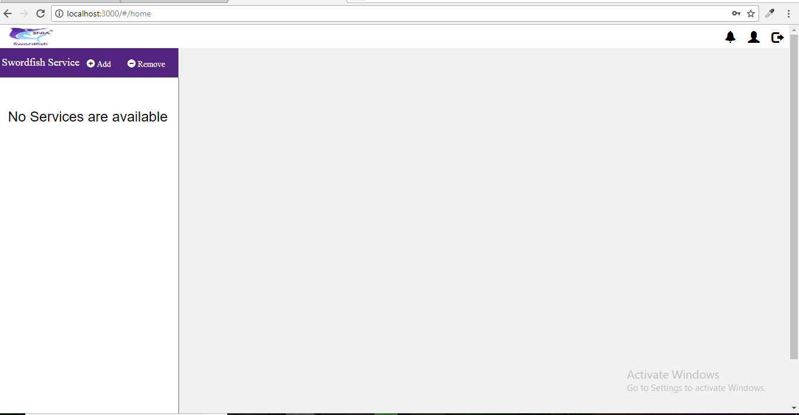

-   Swordfish Basic Web Client allows user to Add/Remove services to the system.

-   Using the ‘Add’ function of a new Service, a new page will visible to user
    with a form containing IP address, Domain Name, User Name and Password.

-   User Name and Password are used by the server for authentication purpose.

-   **IP Address**: Provide the IP Address of server where real time systems
    data resides. A port number also needs to be included while adding the IP
    address.

    **ex**: http://localhost:8089

    **ex:** 10.12.14.15:9000    
    **Format:** \<IP address> : \<Port Number>

-   IP address Port Number

-   **Domain Name**: Identification string (For user understandable IP Address
    are mapped to domain name)

Any errors while adding the services are handled and shown to the user in the
alert box indicating the cause.

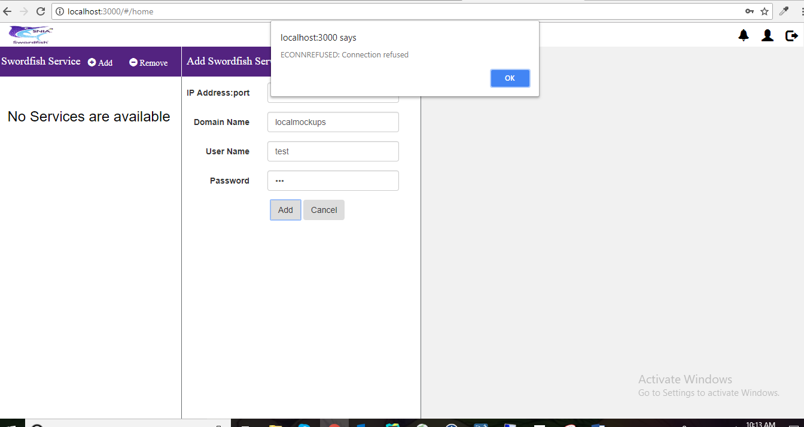

Once completed, a new service is added to the list as shown below.

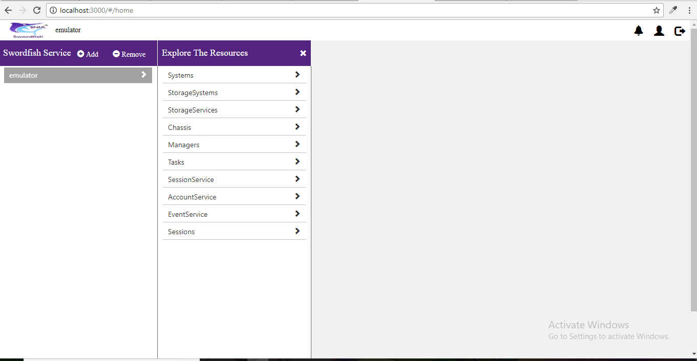

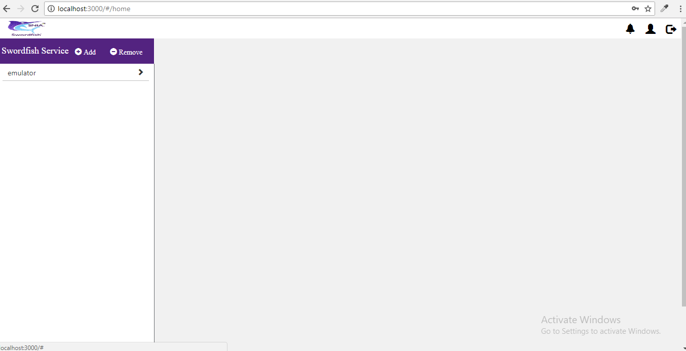

By clicking on the newly added service, the user can see information related to
that service and the collections present under it. The user can also explore
through the collections

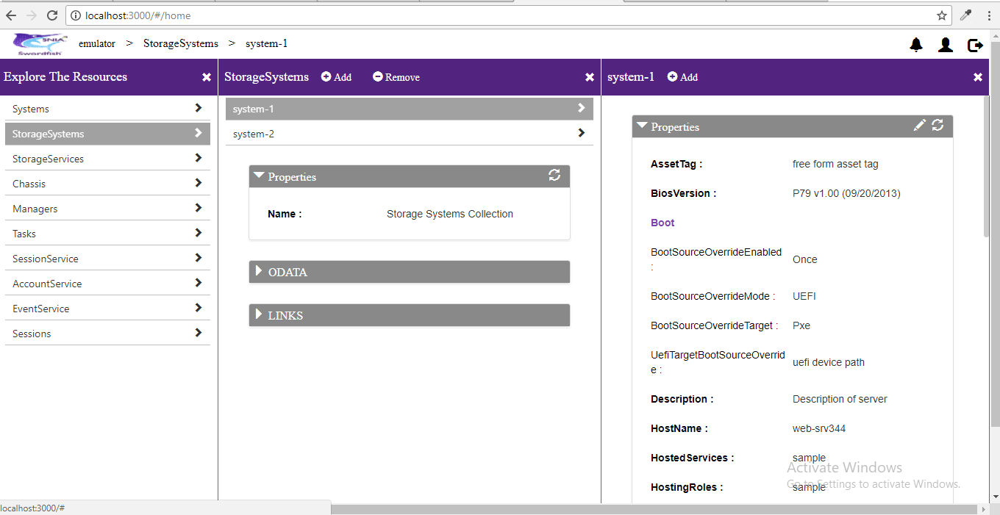

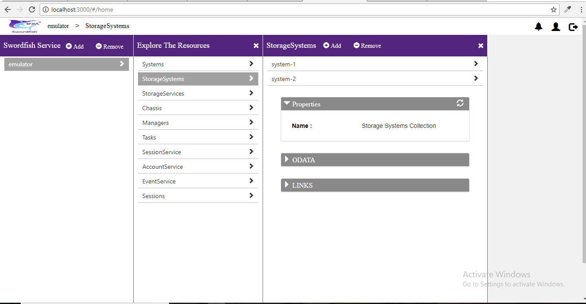

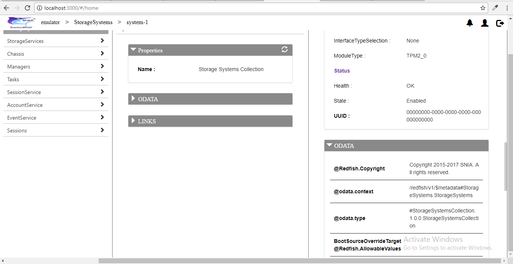

[Top](#section)

### Delete Swordfish Service

Deletes the added Swordfish Services on user approval. A service call is made to
the respective API Endpoint to delete the session created to prevent
DOS attacks.

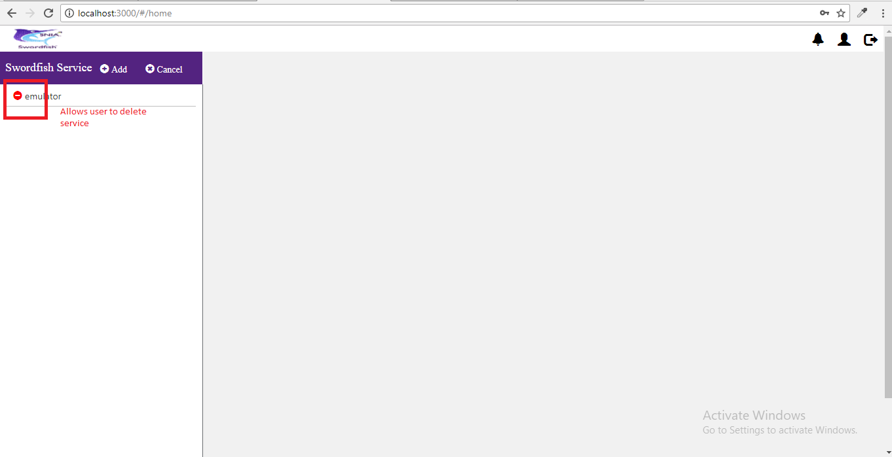

-   User is prompted with an alert to delete the selected Service

-   If user wishes to delete, click on Yes button. Else click No

-   On Yes, the session ID created will be cleared.

-   On No, user will be back to original state, able to see the added service
    and can perform regular actions.

    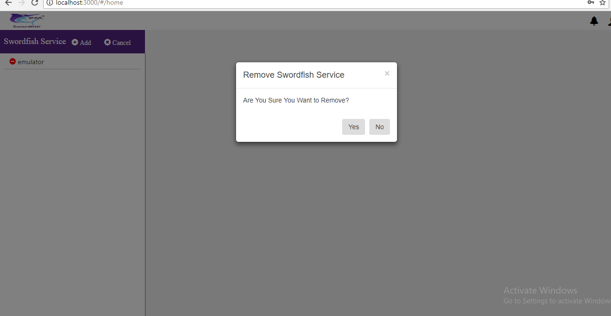

[Top](#section)

### Add Collection

An ‘Add’ option is provided at collection level to add a new collection to the
existing service.

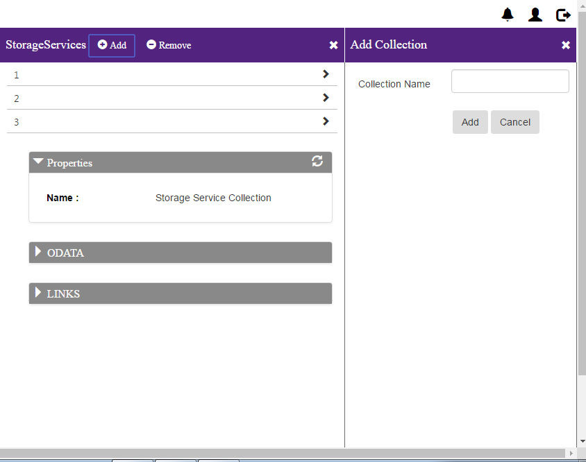

[Top](#section)

### Delete Collection

A ‘remove’ option is provided at collection level to remove existing collection.

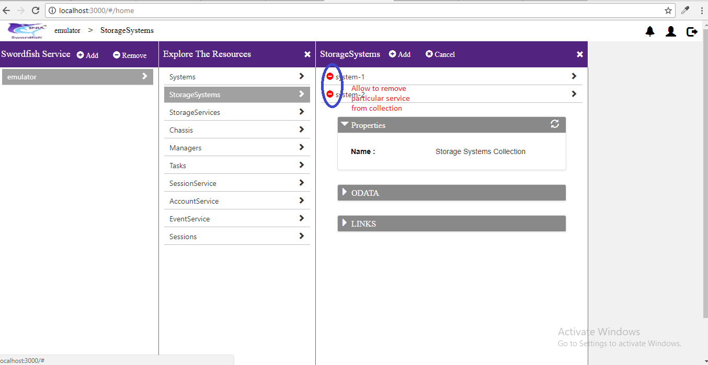

[Top](#section)

### Edit Properties

-   A series of options are provided to edit, save or cancel the changes made to
    the existing properties.

-   User can click on the pencil icon on the properties tab to edit the existing
    properties.

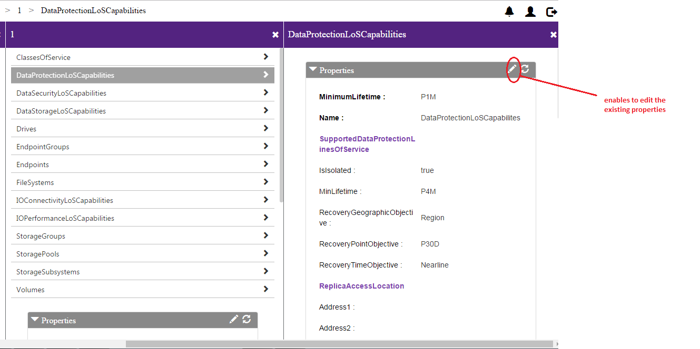

-   On Edit, user can save the changes or cancel them.

    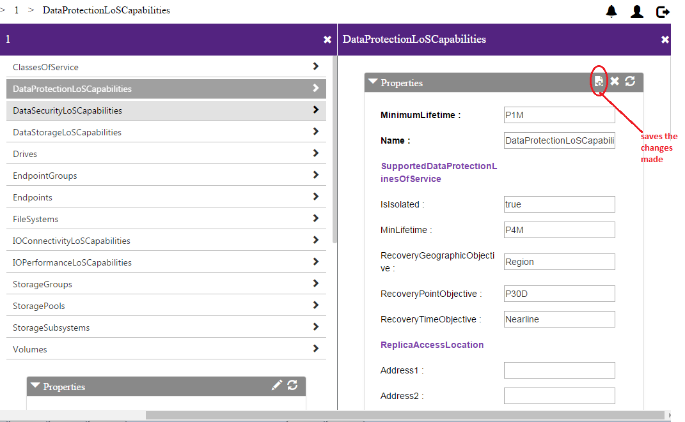

    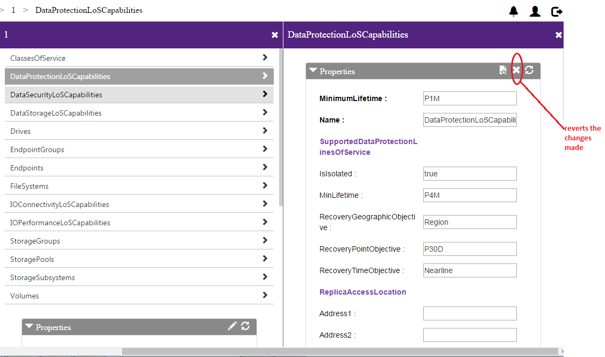

    Without refreshing the entire page, a refresh option is provided in the tab
    to view the immediate changes made

    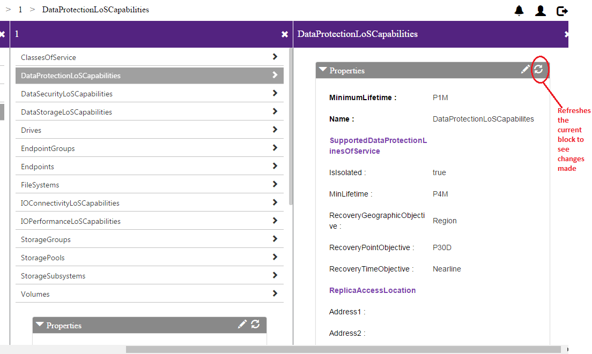

[Top](#section)

### Logout

Deletes the Session and Services added by the user. A service call is made to
the respective API Endpoint to delete the Session created to prevent
DOS attacks.

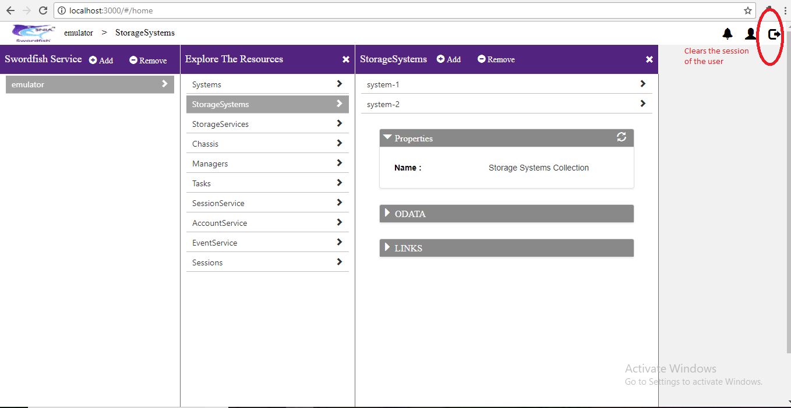

[Top](#section)

Additional information on the SNIA Swordfish specification and use is available
at <https://www.snia.org/swordfish> and <https://github.com/SNIA>
